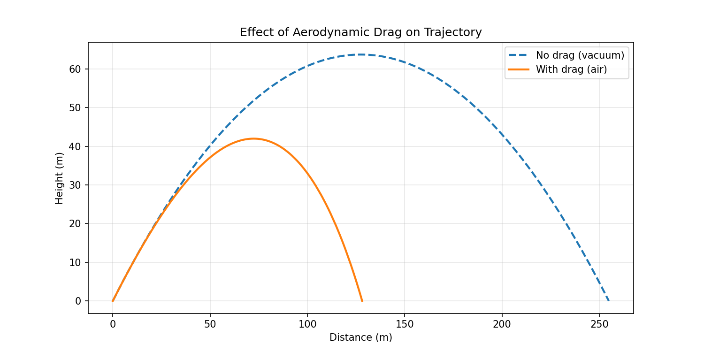

# Projectile Simulation with Aerodynamic Drag

A physics-based projectile simulator built from scratch in **C++17**, featuring aerodynamic drag modeling, real-time visualization with Raylib, and comparative analysis between vacuum and air trajectories.

> **This project demonstrates:** Computational physics, Clean Architecture in C++, numerical integration (Euler method), and software engineering principles applied to robotics foundations.

---

## Demo

<video src="docs/simulation.mov" width="700" autoplay loop muted></video>

*Real-time simulation showing a projectile launched with aerodynamic drag. Notice how drag reduces range and creates trajectory asymmetry compared to a vacuum launch.*

---

## Results

### Trajectory Comparison: Drag vs Vacuum



| Metric | With Drag (Air) | Without Drag (Vacuum) | Difference |
|--------|----------------|----------------------|------------|
| Max Height | ~42 m | ~63.7 m | -34% |
| Range | ~109 m | ~163 m | -33% |
| Flight Time | ~4.6 s | ~7.2 s | -36% |
| Peak Time | ~2.69 s | ~3.6 s | Asymmetric vs Symmetric |

**Key Observations:**
- The vacuum trajectory is a perfect parabola (symmetric)
- Air resistance creates an asymmetric curve — the descent is steeper than the ascent
- Drag force grows with velocity² — meaning it dominates at high speeds and diminishes as the projectile slows
- The horizontal velocity continuously decreases (unlike vacuum where it's constant)

---

## Physics Model

### Forces Applied

**Gravity:**

$$\vec{F}_{gravity} = -m \cdot g \cdot \hat{j}$$

**Aerodynamic Drag:**

$$\vec{F}_{drag} = -\frac{1}{2} \cdot \rho \cdot C_d \cdot A \cdot |\vec{v}|^2 \cdot \hat{v}$$

Where:
- $\rho$ = Air density (1.225 kg/m³ at sea level)
- $C_d$ = Drag coefficient (0.47 for a sphere)
- $A$ = Cross-sectional area (0.01 m²)
- $|\vec{v}|^2$ = Speed squared (quadratic growth)
- $\hat{v}$ = Unit velocity vector (drag opposes motion)

### Numerical Integration (Euler Method)

$$\vec{a} = \frac{\vec{F}_{total}}{m}$$

$$\vec{v}_{n+1} = \vec{v}_n + \vec{a} \cdot \Delta t$$

$$\vec{p}_{n+1} = \vec{p}_n + \vec{v} \cdot \Delta t$$

With $\Delta t = 0.001s$ for high precision.

---

## Architecture

The project follows **Clean Architecture** principles:

```
src/
├── domain/                ← Pure logic, zero external dependencies
│   ├── vec2.hpp           ← Value Object: 2D vector with operator overloading
│   ├── projectile.hpp/cpp ← Entity: projectile state + behavior
│   └── forces.hpp/cpp     ← Domain Service: gravity & drag calculations
├── application/           ← Use Cases / Orchestration
│   ├── i_exporter.hpp     ← Port: abstract export interface
│   └── simulation.hpp/cpp ← Use Case: simulation loop
├── infrastructure/        ← I/O Adapters
│   └── csv_exporter.hpp/cpp ← Adapter: writes trajectory to CSV
├── main.cpp               ← Composition Root (CSV output)
└── main_visual.cpp        ← Composition Root (Raylib visualization)
```

### Design Decisions

- **Value Objects** (`Vec2`): Operator overloading for natural math syntax
- **Entities** (`Projectile`): Encapsulated state with private members
- **Dependency Inversion**: `Simulation` depends on `IExporter` interface, not concrete implementation
- **Separation of Physics from I/O**: Domain layer has zero knowledge of file system or graphics

---

## Tech Stack

| Technology | Purpose |
|-----------|---------|
| C++17 | Core language |
| CMake | Build system |
| Raylib | Real-time 2D visualization |
| Python + Matplotlib | Static plot generation |
| Euler Integration | Numerical method |

---

## Getting Started

### Prerequisites

- C++17 compiler (Clang, GCC)
- CMake 3.20+
- Raylib (`brew install raylib` on macOS)
- Python 3 with pandas & matplotlib (for plots)

### Build & Run

```bash
git clone https://github.com/YOUR_USERNAME/projectile-sim.git
cd projectile-sim

cmake -B build
cmake --build build

# CSV simulation
mkdir -p output
./build/app

# Visual simulation (real-time)
./build/sim_visual

# Generate plots
python scripts/plot_trajectory.py
```

---

## What I Learned

This was my first C++ project, built as Checkpoint 1 of a robotics learning roadmap:

- **C++ fundamentals:** Compilation model, headers/source separation, linking, const correctness
- **OOP in C++:** struct vs class, operator overloading, virtual interfaces
- **Physics simulation:** Translating equations into code, numerical integration, timestep selection
- **Software architecture:** Clean Architecture applied to a non-web domain
- **Debugging:** Name shadowing bugs, linker errors, CMake configuration

Coming from TypeScript/Python — what surprised me:
- The manual memory model forces you to understand what you're writing
- Operator overloading makes math code beautiful (`velocity + acceleration * dt`)
- Compilation catches entire categories of bugs before runtime
- Header/source separation is a powerful organizational tool

---

## Roadmap

This project is part of a structured path toward autonomous robotics:

- [x] **Checkpoint 1:** Projectile with aerodynamic drag ← You are here
- [ ] **Checkpoint 2:** A* Pathfinding
- [ ] **Checkpoint 3:** Differential robot with PID control
- [ ] **Checkpoint 4:** AUV (underwater vehicle) simulation
- [ ] **Checkpoint 5:** ROS 2 + Gazebo integration
- [ ] **Checkpoint 6:** Drone hover control
- [ ] **Checkpoint 7:** Autonomous drone racing with Deep RL

---

## License

MIT

---

Built with curiosity and physics.
